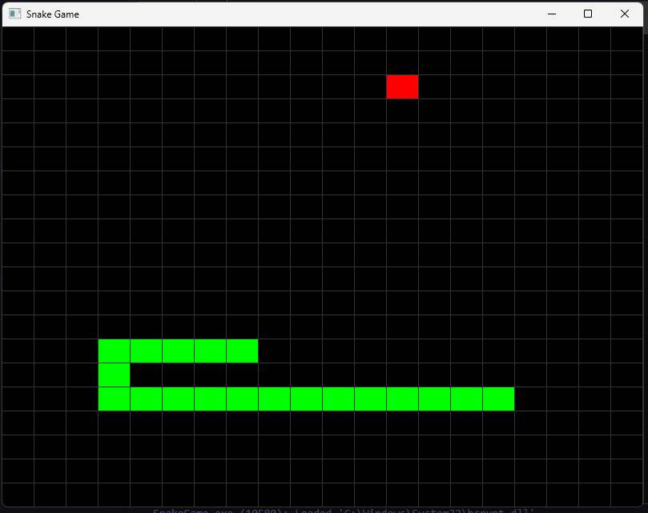

# Snake Game C++

Um clone do clássico jogo da cobrinha (Snake) feito em C++ com OpenGL.

## Sobre o Jogo

Este é um projeto simples do jogo Snake para demonstrar o uso de C++ moderno com a biblioteca gráfica OpenGL. O jogador controla uma cobra que cresce ao comer "comida" que aparece em locais aleatórios. O jogo termina se a cobra colidir com as bordas da tela ou com seu próprio corpo.

## Imagem do Jogo



## Tecnologias Utilizadas

*   **Linguagem:** C++17
*   **Gráficos:** OpenGL
*   **Janela e Input:** GLFW
*   **Matemática:** GLM (OpenGL Mathematics)
*   **Sistema de Build:** CMake

## Pré-requisitos

Para compilar e executar este projeto, você precisará ter o [CMake](https://cmake.org/install/) instalado em seu sistema.

## Como Compilar e Executar

Siga os passos abaixo para compilar e rodar o jogo.

**1. Configurar o projeto com CMake:**

```bash
cmake -B build
```

**2. Compilar o projeto:**

```bash
cmake --build build
```

**3. Executar o jogo:**

```bash
./build/SnakeGame
```
